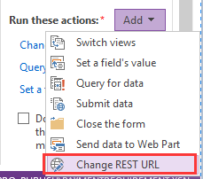
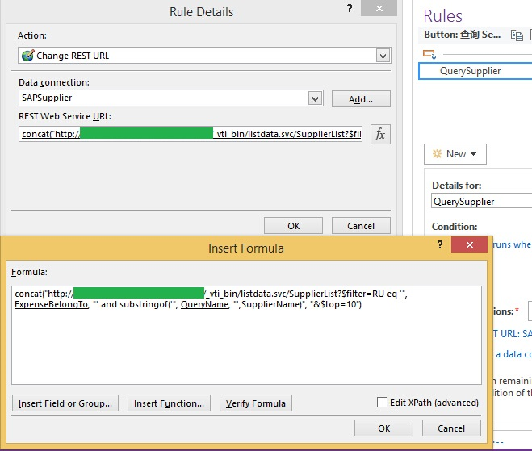

# 无码制作一个InfoPath LOV
    作者：柒月

## 摘要
LOV（List of values）在表单中起到了很关键的作用，它能极大地减少用户录入信息的错误率，以及缩短表单的填写时间。

举个简单的例子，在审批流程中，用户想指定某一级的审批人，但是不记得这个审批人的完整的账号信息。在这里，SharePoint给了一个控件————PeoplePicker，用户可以使用控件，通过显示名，邮箱等信息，模糊筛选到一批账号信息，并从中选择需要的审批人，完成人员的选择。这就是一个LOV。

然而，PeoplePicker并不好用。那么下面我们就一起制作另一个并不好用的LOV，在InfoPath中。

如图，我正做一个操作————以公司为关键词进行模糊查询，找到10条信息，点击左边的选择按钮，将会把供应商描述和供应商代码一并带出并赋值给上面两个文本框。

## 过程

刚开始做时，遇到一个尴尬的问题。RepeatTable控件可以绑定一个SPList数据源，但是对数据源进行筛选，只能通过给QueryFields赋值的方式，这样就意味着模糊筛选行不通，只能想办法绕路了。

还好数据源可以选择REST Web Service。添加了一个REST Web Service后，

Rules里的Action神奇地多了一条Change REST URL。

我只要在点击查询按钮时，根据[REST API](https://msdn.microsoft.com/en-us/library/fp142385 "REST API")重新拼接出一条带筛选（$filter）、分页（$top、$skip）、排序（$orderby）的URL，再对这个URL进行Query操作，那么我就得到了需要的数据了。

