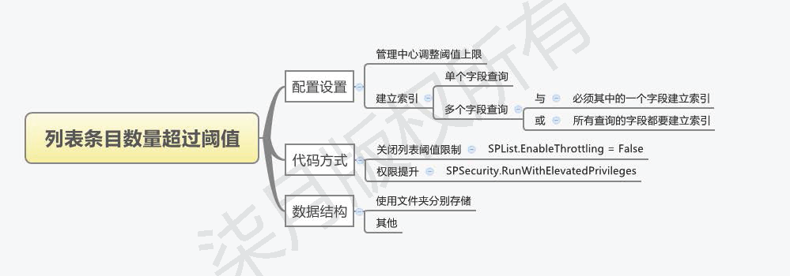

#捞数据请节制——SPList阈值
    作者：柒月 & jingnansu
    
首先，请大家跟我一起念一遍——阈（yù）值，这个字是这么写的——外面一个`“门”`里一个`“或”`，不是`“阀（fá）”`。我之前傻傻分不清楚，直到那次，和客户聊技术，我滔滔不绝，他云里雾里，唯独每次说到这个词，他都会打断我说`“是阈（yù）值”`。好吧，咱做技术的还是严谨一点好。:)

##初遇

相信很多人真正接触阈值，是被它虐了。一段从SPList捞数据的代码，妥妥地运行了几个月，突然从某天开始不好使了，总是抛出一个异常：`SPQueryThrottledException，不允许执行所尝试的操作，因为它已超过管理员规定的列表视图阈值`。

赶紧谷歌度娘找大神，找到原因：为了提高并发效率（[管理包含大量项目的列表和库](https://support.office.com/zh-cn/article/管理包含大量项目的列表和库-11ecc804-2284-4978-8273-4842471fafb7 "管理包含大量项目的列表和库")），SharePoint为普通用户设定了一个默认值5000（审核员和网站集管理员的默认值为20000），当一次检索(排序)的列表或库项目的数量超过5000时，系统就会抛出SPQueryThrottledException异常。

##解决

* 最简单粗暴也最令人不安的做法当然是直接调整阈值大小。入口：`CA->应用程序管理->常规设置->资源限制`；

* 修改[SPList.EnableThrottling](https://msdn.microsoft.com/en-us/library/microsoft.sharepoint.splist.enablethrottling.aspx "SPList.EnableThrottling")为False（须要场管理员权限），那么对此列表读取将不再受阈值限制；

* 或者，干脆直接以管理员身份（[SPSecurity.RunWithElevatedPrivileges](https://msdn.microsoft.com/en-us/library/microsoft.sharepoint.spsecurity.runwithelevatedprivileges.aspx "SPSecurity.RunWithElevatedPrivileges")）读取列表。

##要节制
任意地突破SPList阈值，拿它当摆设，为了实现业务需求，完全不考虑并发性能和效率，真的好吗？

其实，在很多业务场景下都可以避免，只要合理利用索引和数据切分。

###索引
可以为SPList设置索引栏（`列表设置->索引栏->新建索引`）。以下为[jingnansu](https://github.com/jingnansu "jingnansu")的测试结果：

* SPList未设置索引，SPList.ItemCount大于阈值，普通用户使用`SPQuery.Query`对`普通栏`做筛选，抛出阈值异常
* SPList未设置索引，SPList.ItemCount大于阈值，筛选数据时，设置`SPQuery.Query`为null、`SPQuery.RowLimit`大于阈值，则抛出异常；设置`SPQuery.RowLimit`小于阈值则可以正常取出数据
* SPList设置某栏为索引栏，SPList.ItemCount大于阈值，普通用户对`索引栏`做筛选，若`结果集`数量大于阈值，则抛出阈值异常。若`结果集`数量小于阈值，则可正常取出数据。若两个查询条件由`<Or>`组成，则两个查询栏都必须为索引栏；若两个查询条件由`<And>`组成，则查询栏至少包含一个索引栏

###数据切分
对于SPItem数量巨大的列表或库，我们可以将SPItem按照一定规则存入列表下的文件夹（`SPFolder`）中，例如按照年份、月份或者创建人等划分文件夹，SPItem放入相应的文件夹内，确保每个文件夹中的SPItems数量控制在阈值之内。

用这个方式也能有效地避免阈值异常，提高存取效率。

附：[jingnansu](https://github.com/jingnansu "jingnansu")精心制作的脑图

