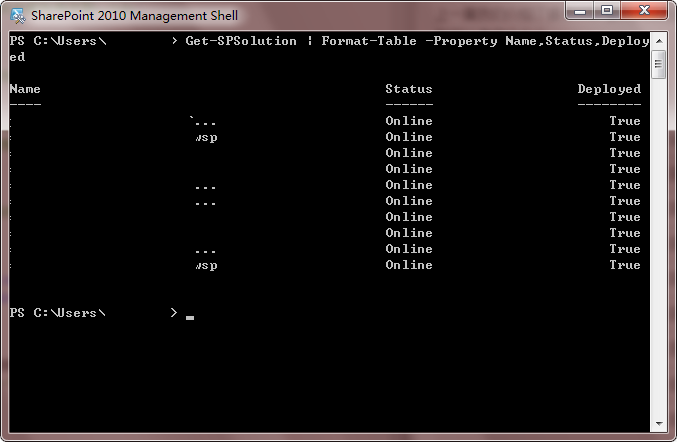

# Get-SPSolution
	作者：sujingjiang

上一篇我们介绍了操作WSP解决方案包的相关命令, 如果我们想获取某个解决方案包的相关属性则可以使用此命令.

## 一些属性
<table>
    <tr>
        <td>名称</td>
        <td>说明</td>
    </tr>
    <tr>
        <td>Deployed</td>
        <td>获取是否已经将解决方案部署到服务器场中</td>
    </tr>
    <tr>
        <td>DeployedServers</td>
        <td>获取此解决方案包部署到的服务器名称</td>
    </tr>
    <tr>
        <td>DeployedWebApplications</td>
        <td>获取此解决方案包部署到的 web 应用程序名称</td>
    </tr>
    <tr>
        <td>DeploymentState</td>
        <td>获取是否已经部署了此解决方案包</td>
    </tr>
    <tr>
        <td>Farm</td>
        <td>获取此解决方案包安装在的服务器场名称</td>
    </tr>
    <tr>
        <td>JobExists</td>
        <td>是否Job跟此解决方案包有关联</td>
    </tr>
    <tr>
        <td>Name</td>
        <td>返回此解决方案包的名称</td>
    </tr>
    <tr>
        <td>SolutionId</td>
        <td>返回此解决方案包的ID</td>
    </tr>
    <tr>
        <td>Status</td>
        <td>获取或设置此解决方案包的状态</td>
    </tr>
</table>

具体可以点击[链接](https://msdn.microsoft.com/ZH-CN/library/microsoft.sharepoint.administration.spsolution_properties.aspx "SPSolution 属性")查看.

## 例子
显示当前环境中的解决方案包信息     
`Get-SPSolution | Format-Table -Property Name,Status,Deployed`

enjoy SharePoint
